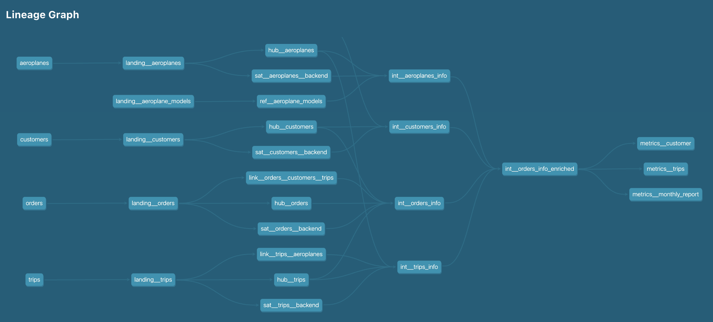

# ariboltic-data-model
A repostiroy to host the data model for AirBoltic project.

## Requirements to run the dbt project locally
 1. The code was implemented using Python3.11
 2. Poetry as packet manager. Please run `pip install poetry` to install it
 3. As dbt-spark is being used as connector, it is necessary to have Java (Spark requirement). In MacOs,
    you can run `brew install openjdk@17`

## Create a virtual environment based on Python 3.11
```
poetry env use python3.11
```

## Install dependencies
```
poetry install
```

### Interact with dbt
First cd to dbt project root.
```
cd dbt
```
We also to define a couple of environmental variables:
```
export USER=<your_user>
export ENV=<environment> 
```
Where user is your user and environment is the target environment, dev or prod.

The project is based on dbt-spark connector with session method. This means that
dbt will create and ad-hoc local spark session and warehouse (usually in dbt/spark-warehouse)
to execute the SQL code and store the tables.

Important!!!
If ENV is set to prod, the custom schemas defined in the dbt_project files will be
used to generate the tables associated with the models. Otherwise, all the models will
be generated under schema <author>_dev.

After setting the ENV variables, wee need to initialize the source data.
```
make initialize-db
```
And we are set up! You should be able now to execute dbt commands.

Specially recommended is to generate and serve the dbt docs.
```
dbt docs generate
dbt docs serve
```

Usually, after running these you can access the docs under http://localhost:8080/#!/overview

Here is a snapshot of the generated lineage graph:


